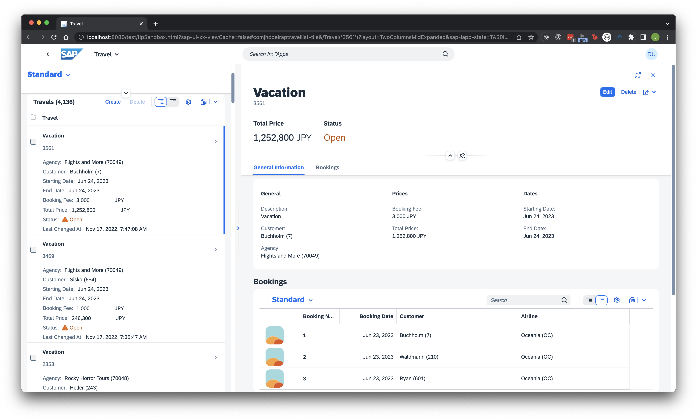

# Create a Travel App with SAP Fiori Elements

Create a list report object page application using your SAP Business Technology Platform trial account and SAP Business Application Studio. The application is based on an OData V4 service built with the SAP ABAP RESTful Application Programming Model (RAP) within the ABAP Development Tools environment. Learn how to adjust the UI to your needs by using UI annotations and leveraging the Flexible Programming Model.

See: [Create a Travel App with SAP Fiori Elements Based on OData V4 RAP Service](https://developers.sap.com/group.fiori-tools-odata-v4-travel.html)

- Run the app

```shell
> cd app/travellist
> npm start
```



## DEPLOYMENT TO BTP ABAP REPOSITORY

- Deploy the Fiori Element app to BTP ABAP Repository

```shell
> cd app/travellist
> npm run deploy
```

See [Create a SAP Fiori App in Visual Studio Code and Deploy it to SAP BTP, ABAP Environment](https://developers.sap.com/tutorials/abap-environment-vs-code.html)

## DEPLOYMENT TO HTML5 APP REPOSITORY

- Deploy the Fiori Element app to HTML5 Application Repository

```shell
> npm run build
> npm run deploy
```

See [Create a SAP Fiori App and Deploy it to SAP BTP, Cloud Foundry environment](https://developers.sap.com/tutorials/abap-environment-deploy-cf.html)